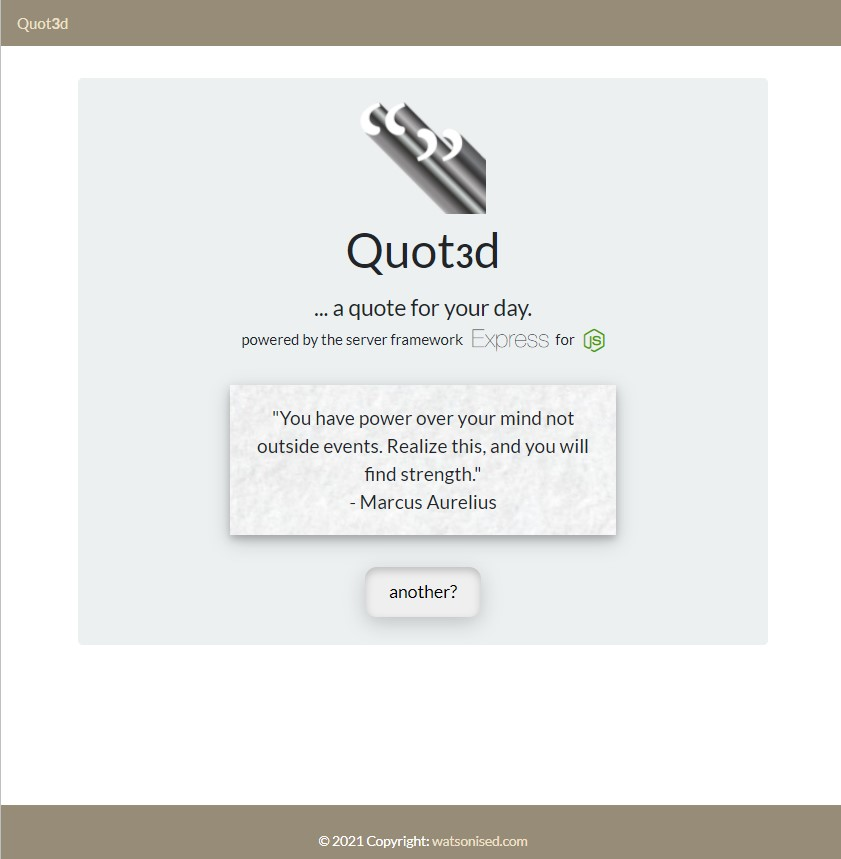

  

# Get your Quote for the day

### Table of Contents  
  
   1. [Project Description](#1-description)
   2. [Application Features](#2-features)
   3. [Installation](#3-installation)
   4. [Usage](#4-usage)
   5. [Credits](#5-credits)
   6. [License](#6-license)
   7. [Repository Status](#7-github-repo-status)
   8. [Contribute](#8-how-to-contribute)
   9. [Tests](#9-tests)
   10. [Checklist](#10-checklist)

---
### 1. Description  
**What is this project?**  
* I originally wanted to see if I could get Heroku to work with mySQL.  I like reading quotes so I thought I'd have a go at creating a SQL database of quotes.  

* I've refactored this project now for Netlify using lambda functions.

**Why this project?**  
* Quotes can be inspiring, make you refocus, feel energised, feel the deeper understanding humans are capable of.  

**What problem does this project solve?**  
* Provides a polished mobile responsive website that accesses a mySQL database hosted on Heroku that randomly selected from approximately 1700 quotes.
* Routes to update, delete and post quotes have been coded however they are for administrators and I ask that you respect the database and not work out the routes to modify it.

**Lessons learnt?**  
* It was challenging setting up SQL to work on Heroku however I found a great walkthrough that helped a lot.  See [Credits](#5-credits).

---
### 2. Features  
- provides access to a database of over 1,600 quotes.
- when the page is opened there is SQL query that randomly selects a quote for you and prints it to the page.
- there is a button if the user chooses to request the database provide another random quote, should 1 quote for the day not be enough.
- the webpage has a polished and mobile-responsive user interface that should be readable on smaller devices in both portrait and landscape.

---
### 3. Installation  
You can download the source code from [my Github repository](https://github.com/Mark33Mark/quoted) and install the dependencies, Node and Express, to be able to run the app on your localhost.  
Alternatively, the webpage has also been hosted via [URL: quote.watsonised.com](http://quote.watsonised.com) or at [URL: Heroku ](https://quot3d.herokuapp.com)

---
### 4. Usage  
The code can be downloaded from [my Github repository](https://github.com/Mark33Mark/quoted) for all assets created for the project.  
You can modify the code as you need.

---
### 5. Credits  
Huge thanks go to BezKoder for a really well set out and explained walkthrough that I relied on heavily to do this project [website link](https://www.bezkoder.com/node-js-rest-api-express-mysql/)
Also the University of Sydney FSF Bootcamp course that provided great guidance for this project from the course content.

---
### 6. License  
 The works in this repository are subject to:  

---
### 7. Github repo status  

---
### 8. How to Contribute
 If you would like to contribute, please comply with the Contributor Covenant Code of Conduct:  

---
### 9. Tests  
- No tests have been prepared yet for this project.
- The UI of the completed app has been tested on an iPhone 8 and Samsung Note 10+.

---
### 10. Checklist  
 All actions not checked are still to be completed:  
   [x]  A MVP completed for distribution.  
   [x]  Page responsiveness for different devices tested.  
   [x]  The routes for deleting, posting, pushing have all been tested and work as expected.  
   [x]  Webpage has a polished and mobile-responsive user interface.  
   [x]  Webpage is hosted on [Netlify](https://quot3d.netlify.app)  
   [x]  Repository contains a README file with descriptio, screenshot and link to deployed application.  

---

[Back to the top](#get-your-quote-for-the-day)